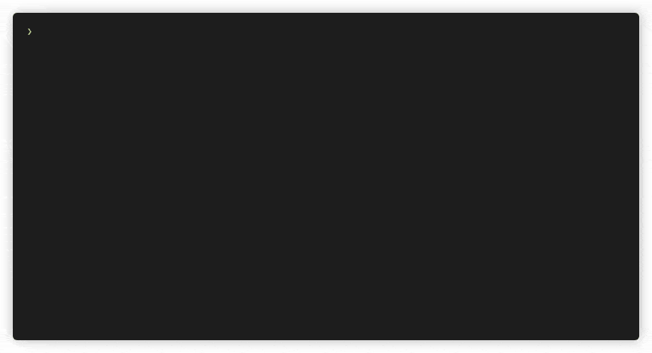

<!-- Update this link with your own project logo -->
#  README Template
 A template project / CLI tool for creating a README and other files for Python projects on GitHub.

<!-- Find new badges at https://shields.io/badges -->
[](https://opensource.org/licenses/MIT)

- This project contains templates you can use to write your own `README`, `CONTRIBUTING` and `PULL_REQUEST_TEMPLATE` files.
- It also includes a CLI tool for using these files in your own projects.
- Supports `pip` or `poetry` for dependency management.

[](https://github.com/faressoft/terminalizer)

## Install dependencies

If using `pip`:

```sh
pip install -r requirements.txt
```

If using `poetry`:

```sh
poetry install --without dev
```

## Usage

1. Run the program from the command line (from the project root) like this:

- The first argument is the month (1-12).
- The second argument is the day (1-31).

E.g.:

If using `pip`:

```sh
python3 readme_generator/src/generator.py
```

If using `poetry`:

```sh
poetry run python readme_generator
```

## Contributing

<!-- Remember to update the links in the `.github/CONTRIBUTING.md` file from `Cutwell/readme-template` to your own username and repository. -->

For information on how to set up your dev environment and contribute, see [here](.github/CONTRIBUTING.md).

## License

MIT
